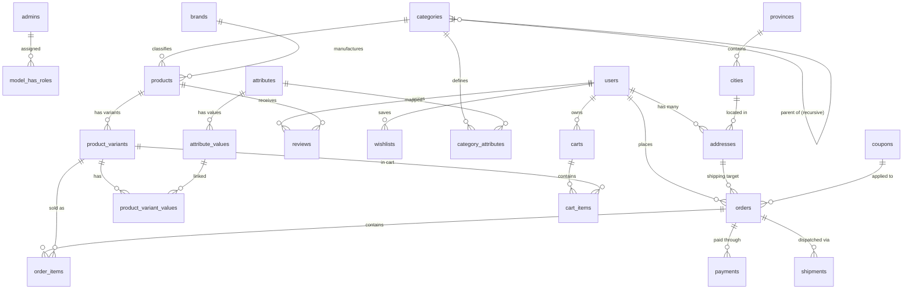
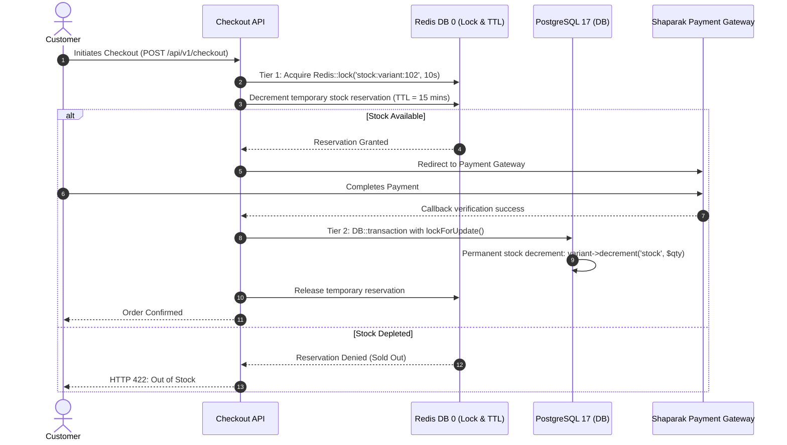

# Reyhan Commerce — Backend Technical Specification & Architecture Guide

This document defines the comprehensive architecture, design patterns, database blueprints, coding standards, and implementation roadmap for the headless domain engine of the **Reyhan Commerce** framework.

---

## 1. Core Technology Stack & Package Ecosystem

| Package / Tool | Version / Source | Purpose & Architectural Role |
| :--- | :--- | :--- |
| **Laravel Framework** | `13.x` | Base modern PHP application framework |
| **Primary Relational Database** | **PostgreSQL 17.x** | Enterprise relational database with native JSONB, `pg_trgm`, and spatial support |
| **Redis Infrastructure** | `7.x+` (phpredis) | **Default driver** for Cache, Sessions, and Queues |
| **PHP 8.3+ Backed Enums** | Native PHP | Strongly-typed domain statuses, types, and Filament badges |
| **Spatie Laravel Data** | [`spatie/laravel-data`](https://github.com/spatie/laravel-data) | **Mandatory DTO standard** for strongly-typed, transformable data objects |
| **Spatie Laravel Settings** | [`spatie/laravel-settings`](https://github.com/spatie/laravel-settings) | Typed, class-based database settings with native encryption support |
| **Spatie Sluggable** | [`spatie/laravel-sluggable`](https://github.com/spatie/laravel-sluggable) | Persian-friendly automatic and unique slug generation |
| **Text Normalization Engine** | Internal Pipeline (`app/Services/Normalization/`) | Mandatory Persian character, digit, and ZWNJ standardizer |
| **Laravel Octane** | Latest | High-performance in-memory server (Swoole / FrankenPHP) |
| **Laravel Horizon** | Latest | Redis queue monitoring, dashboard, and worker management |
| **Laravel Pulse** | Latest | Real-time performance monitoring (slow queries, jobs, requests) |
| **Laravel Sanctum** | Latest | Token-based authentication for regular user shopping sessions |
| **Filament Admin Panel** | `5.x` | Dedicated Persian (`fa`) RTL admin panel for the `admin` guard |
| **Filament Shield** | [`bezhansalleh/filament-shield`](https://filamentphp.com/plugins/bezhansalleh-shield) | Role-Based Access Control (RBAC) restricted strictly to `Admin` models |
| **Filament Settings Plugin** | [`filamentphp/spatie-laravel-settings-plugin`](https://github.com/filamentphp/spatie-laravel-settings-plugin) | Visual tabbed management of system, encrypted SMS, and payment settings |
| **Filament Media Library** | [`filamentphp/spatie-laravel-media-library-plugin`](https://github.com/filamentphp/spatie-laravel-media-library-plugin) | Product images, category banners, attribute swatches, and media conversions |
| **Filament Backup Plugin** | [`shuvroroy/filament-spatie-laravel-backup`](https://github.com/shuvroroy/filament-spatie-laravel-backup) | Backup creation, monitoring, and downloads via `spatie/laravel-backup` |
| **Iranian Validation Rules** | [`iamfarhad/validation`](https://github.com/iamfarhad/validation) | Validation rules for Iranian mobile, national code, postal code, IBAN, and cards |
| **Online Payment Gateway** | [`shetabit/payment`](https://github.com/shetabit/payment) | Unified driver-based payment processing for Iranian banks & Shaparak |
| **Jalali Date Engine** | `morilog/jalali` | Shamsi calendar conversion and formatting across Filament and API outputs |
| **API Documentation** | [`dedoc/scramble`](https://scramble.dedoc.co/) | Zero-annotation OpenAPI 3.1 generator with **Scalar API Reference** UI (`/docs/api`) |
| **Testing Framework** | Pest PHP (Latest) | Functional, Unit, and Feature testing suite (Strictly Non-UI) |
| **Code Formatter** | Laravel Pint | Automated PSR-12 and Laravel code style enforcement |
| **Static Analyzer** | Larastan (PHPStan) | Level 8 strict static analysis |
| **Self-Hosted Captcha** | Internal Custom Module | In-house mathematical/SVG visual captcha engine with zero third-party reliance |
| **Multi-Driver SMS System** | Internal Custom Module | Driver-based SMS engine with `Manager` pattern and custom Notification Channel |

---

## 2. Multi-Auth Architecture: Complete Separation of Admins and Users

A fundamental architectural boundary is enforced between store staff/administrators and regular customers:

```mermaid
graph TD
    subgraph StaffAccess [Staff & Operations]
        AdminUser[Admin Staff] -->|Session Auth fa/RTL| FilamentPanel[Filament 5 Admin Panel]
        FilamentPanel --> AdminGuard[Guard: admin]
        AdminGuard --> AdminModel[Model: Reyhan\Core\Models\Admin]
        AdminModel --> SpatieShield[Spatie Permissions & Filament Shield]
    end

    subgraph CustomerAccess [Customer Shopping]
        Customer[Customer] -->|OTP SMS Auth| NuxtFrontend[Nuxt 4 Frontend]
        NuxtFrontend --> SanctumGuard[Guard: sanctum]
        SanctumGuard --> UserModel[Model: Reyhan\Core\Models\User / App\Models\User]
        UserModel --> ShoppingEntities[Orders, Addresses, Reviews, Cart]
    end
```



### 2.1. Authentication Configuration (`config/auth.php`)
```php
return [
    'defaults' => [
        'guard' => 'sanctum',
        'passwords' => 'users',
    ],

    'guards' => [
        'web' => [
            'driver' => 'session',
            'provider' => 'users',
        ],
        'sanctum' => [
            'driver' => 'sanctum',
            'provider' => 'users',
        ],
        'admin' => [
            'driver' => 'session',
            'provider' => 'admins',
        ],
    ],

    'providers' => [
        'users' => [
            'driver' => 'eloquent',
            'model' => \Reyhan\Core\Models\User::class,
        ],
        'admins' => [
            'driver' => 'eloquent',
            'model' => \Reyhan\Core\Models\Admin::class,
        ],
    ],
];
```

### 2.2. User Model & Schema (`users`)
Customers do not use passwords. They log in exclusively via Iranian mobile OTP to verify identity:
```php
Schema::create('users', function (Blueprint $table) {
    $table->id();
    $table->string('first_name')->nullable();
    $table->string('last_name')->nullable();
    $table->string('national_code', 10)->unique()->nullable();
    $table->string('mobile', 11)->unique(); // e.g. 09123456789
    $table->string('email')->unique()->nullable(); // Optional
    $table->string('avatar')->nullable();
    $table->boolean('is_active')->default(true);
    $table->timestamp('mobile_verified_at')->nullable();
    $table->rememberToken();
    $table->timestamps();

    $table->index(['first_name', 'last_name']);
});
```

### 2.3. Admin Model & Schema (`admins`)
Staff members possess standard credentials and are strictly bound to Spatie Permissions and Filament Shield:
```php
Schema::create('admins', function (Blueprint $table) {
    $table->id();
    $table->string('name');
    $table->string('email')->unique();
    $table->string('password');
    $table->string('avatar')->nullable();
    $table->boolean('is_active')->default(true);
    $table->rememberToken();
    $table->timestamps();
});
```

---

## 3. Mandatory Persian Text Normalization Pipeline

To eliminate search mismatches and database inconsistencies caused by keyboard variations (Arabic vs. Persian characters, Indic/English digits, and invisible control characters), all incoming descriptive inputs and search queries must pass through the **Persian Normalization Pipeline**.

### 3.1. Pipeline Architecture (`packages/core/src/Services/Normalization/`)
```text
packages/core/src/Services/Normalization/
├── PersianNormalizer.php                # Pipeline runner facade
├── Contracts/NormalizerPipeInterface.php
└── Pipes/
    ├── NormalizeDigitsPipe.php          # Arabic/Indic (٠-٩) & English (0-9) -> Persian (۰-۹)
    ├── NormalizeCharactersPipe.php      # Arabic yeh/kaf -> Persian, removes diacritics
    ├── NormalizeSpacingAndZwnjPipe.php  # Fixes ZWNJ (\u200C), strips control characters
    └── NormalizePunctuationPipe.php     # Replaces quotes with « », fixes commas and question marks
```

### 3.2. Pipeline Implementation Code
```php
namespace Reyhan\Core\Services\Normalization;

use Reyhan\Core\Services\Normalization\Pipes\NormalizeCharactersPipe;
use Reyhan\Core\Services\Normalization\Pipes\NormalizeDigitsPipe;
use Reyhan\Core\Services\Normalization\Pipes\NormalizePunctuationPipe;
use Reyhan\Core\Services\Normalization\Pipes\NormalizeSpacingAndZwnjPipe;
use Illuminate\Pipeline\Pipeline;

final class PersianNormalizer
{
    private static array $defaultPipes = [
        NormalizeCharactersPipe::class,
        NormalizeDigitsPipe::class,
        NormalizeSpacingAndZwnjPipe::class,
        NormalizePunctuationPipe::class,
    ];

    public static function clean(?string $text): string
    {
        if ($text === null || trim($text) === '') {
            return '';
        }

        return app(Pipeline::class)
            ->send($text)
            ->through(self::$defaultPipes)
            ->thenReturn();
    }

    /**
     * For machine identifiers (phone numbers, national IDs, postal codes):
     * Normalizes any Persian/Arabic digits to clean ASCII 0-9.
     */
    public static function toAsciiDigits(?string $text): string
    {
        if ($text === null) return '';
        
        $persian = ['۰', '۱', '۲', '۳', '۴', '۵', '۶', '۷', '۸', '۹'];
        $arabic  = ['٠', '١', '٢', '٣', '٤', '٥', '٦', '٧', '٨', '٩'];
        $ascii   = ['0', '1', '2', '3', '4', '5', '6', '7', '8', '9'];

        return str_replace($persian, $ascii, str_replace($arabic, $ascii, $text));
    }
}
```

### 3.3. Key Normalization Pipes

#### `NormalizeCharactersPipe.php`:
- Unifies Arabic Yehs (`ي` \u064A, `ى` \u0649) to Persian Yeh (`ی` \u06CC).
- Unifies Arabic Kaf (`ك` \u0643) to Persian Kaf (`ک` \u06A9).
- Replaces Teh Marbuta (`ة` \u0629) with Heh (`ه`) or Teh (`ت`).
- Strips diacritics and vowel marks (Tanwin, Harakat, Tashdid: `َ ِ ُ ً ٍ ٌ ّ ْ`).

#### `NormalizeDigitsPipe.php`:
- Converts English (`0-9`) and Arabic/Indic (`٠-٩`) numbers into standard Persian numerals (`۰-۹`) for product titles, product descriptions, category titles, customer names, and addresses.

#### `NormalizeSpacingAndZwnjPipe.php`:
- Standardizes broken half-spaces to standard Unicode Zero-Width Non-Joiner (ZWNJ `\u200C`).
- Collapses multi-spaces and strips invisible control characters.

### 3.4. System-Wide Integration Touchpoints
1. **FormRequest Layer (`prepareForValidation`)**:
   ```php
   protected function prepareForValidation(): void
   {
       if ($this->has('name')) {
           $this->merge(['name' => PersianNormalizer::clean($this->name)]);
       }
       if ($this->has('mobile')) {
           $this->merge(['mobile' => PersianNormalizer::toAsciiDigits($this->mobile)]);
       }
   }
   ```
2. **Filament 5 Admin Panel**:
   Form fields in `ProductResource`, `CategoryResource`, and `AttributeResource` utilize `dehydrateStateUsing(fn ($state) => PersianNormalizer::clean($state))`.
3. **Catalog Search Queries (`SearchProductsAction`)**:
   Customer search input is sanitized through `PersianNormalizer::clean($query)` before executing PostgreSQL 17 `pg_trgm` queries, guaranteeing 100% search hit accuracy regardless of the user's keyboard.

---

## 4. Comprehensive Domain Model Relations

All Eloquent relationships are strictly defined with accurate foreign keys and cascades:



---

## 5. Persian Slug Architecture & Automated Uniqueness

Persian URL slugs enhance local SEO and visual branding. Slugs are managed via `spatie/laravel-sluggable`:

### 5.1. Product Slug Configuration (`Reyhan\Core\Models\Product`)
```php
namespace Reyhan\Core\Models;

use Illuminate\Database\Eloquent\Model;
use Spatie\Sluggable\HasSlug;
use Spatie\Sluggable\SlugOptions;

class Product extends Model
{
    use HasSlug;

    public function getSlugOptions(): SlugOptions
    {
        return SlugOptions::create()
            ->generateSlugsFrom('name')
            ->saveSlugsTo('slug')
            ->doNotGenerateSlugsOnUpdate()
            ->allowDuplicateSlugs(false);
    }
}
```

### 5.2. Live Slug Generation in Filament 5 Forms
In `ProductResource.php`, typing the Persian product name automatically updates the unique slug in real time:
```php
TextInput::make('name')
    ->label('نام محصول')
    ->required()
    ->live(onBlur: true)
    ->afterStateUpdated(function (Set $set, ?string $state) {
        $set('slug', Str::slug($state, '-', null)); // Preserves Unicode Persian chars
    }),

TextInput::make('slug')
    ->label('اسلاگ (پیوند یکتا)')
    ->required()
    ->unique('products', 'slug', ignoreRecord: true),
```

---

## 6. Hierarchical Nested Categories Architecture

Categories support infinite nesting (e.g., *Apparel $\rightarrow$ Men $\rightarrow$ Jackets* or *Electronics $\rightarrow$ Audio $\rightarrow$ Headphones*):

### 6.1. Database Schema (`categories`)
```php
Schema::create('categories', function (Blueprint $table) {
    $table->id();
    $table->foreignId('parent_id')->nullable()->constrained('categories')->cascadeOnDelete();
    $table->string('name');
    $table->string('name_en')->nullable();
    $table->string('slug')->unique();
    $table->text('description')->nullable();
    $table->string('icon')->nullable();
    $table->unsignedInteger('order')->default(0);
    $table->boolean('is_active')->default(true);
    $table->timestamps();

    $table->index(['parent_id', 'order']);
});
```

### 6.2. Category Tree Endpoint (`GET /api/v1/categories/tree`)
Returns an efficient recursive JSON tree consumed directly by Nuxt's header mega-menu and category map page:
```php
public function tree(): JsonResponse
{
    $categories = Cache::remember('categories:tree', 86400, function () {
        return Category::whereNull('parent_id')
            ->where('is_active', true)
            ->with(['children' => fn ($q) => $q->where('is_active', true)->with('children')])
            ->orderBy('order')
            ->get();
    });

    return CategoryTreeResource::collection($categories)
        ->success()
        ->message('Category tree retrieved successfully.');
}
```

---

## 7. Headless Sitemap Data Endpoint Architecture

In a modern decoupled architecture:
- **The Backend acts as the Data Provider**: Exposes `GET /api/v1/sitemap/urls` listing all active product slugs, category slugs, and their `updated_at` timestamps cached in Redis.
- **The Frontend acts as the XML Presenter**: Nuxt's `@nuxtjs/sitemap` fetches this endpoint and serves standard XML documents (`/sitemap.xml`, `/sitemap/products.xml`, `/sitemap/categories.xml`).

---

## 8. Standardized RESTful Routing & `apiResource` Conventions

All API routes follow strict RESTful conventions using `Route::apiResource` within `routes/api/v1.php`:

```php
use Reyhan\Core\Http\Controllers\Api\V1\AddressController;
use Reyhan\Core\Http\Controllers\Api\V1\Auth\AuthController;
use Reyhan\Core\Http\Controllers\Api\V1\CartController;
use Reyhan\Core\Http\Controllers\Api\V1\CategoryController;
use Reyhan\Core\Http\Controllers\Api\V1\CheckoutController;
use Reyhan\Core\Http\Controllers\Api\V1\OrderController;
use Reyhan\Core\Http\Controllers\Api\V1\PaymentController;
use Reyhan\Core\Http\Controllers\Api\V1\ProductController;
use Reyhan\Core\Http\Controllers\Api\V1\ReviewController;
use Reyhan\Core\Http\Controllers\Api\V1\SettingsController;
use Reyhan\Core\Http\Controllers\Api\V1\SitemapController;
use Illuminate\Support\Facades\Route;

Route::prefix('v1')->group(function () {

    // Public Store Settings & Metadata
    Route::get('app/settings', [SettingsController::class, 'show']);
    Route::get('sitemap/urls', [SitemapController::class, 'urls']);
    Route::get('captcha', [AuthController::class, 'captcha']);

    // Authentication (OTP)
    Route::prefix('auth')->group(function () {
        Route::post('send-otp', [AuthController::class, 'sendOtp']);
        Route::post('verify-otp', [AuthController::class, 'verifyOtp']);
    });

    // Public Catalog Resources
    Route::get('categories/tree', [CategoryController::class, 'tree']);
    Route::apiResource('categories', CategoryController::class)->only(['index', 'show']);
    Route::apiResource('products', ProductController::class)->only(['index', 'show']);
    Route::apiResource('products.reviews', ReviewController::class)->only(['index']);

    // Cart Management (Guest & Customer)
    Route::apiResource('cart', CartController::class)->only(['index', 'store', 'destroy']);
    Route::put('cart/items/{cartItem}', [CartController::class, 'updateItem']);

    // Authenticated Customer Endpoints
    Route::middleware('auth:sanctum')->group(function () {
        Route::post('auth/logout', [AuthController::class, 'logout']);
        Route::get('auth/me', [AuthController::class, 'me']);
        Route::put('auth/profile', [AuthController::class, 'updateProfile']);

        // Post-Login Cart Sync
        Route::post('cart/sync', [CartController::class, 'sync']);

        // Customer Resources
        Route::apiResource('addresses', AddressController::class);
        Route::apiResource('orders', OrderController::class)->only(['index', 'show']);
        Route::apiResource('products.reviews', ReviewController::class)->only(['store']);

        // Checkout & Payment
        Route::post('checkout/create-order', [CheckoutController::class, 'createOrder']);
        Route::post('checkout/apply-coupon', [CheckoutController::class, 'applyCoupon']);
        Route::post('payment/verify', [PaymentController::class, 'verify']);
    });
});
```

---

## 9. Concurrency Control & Two-Tier Inventory Locking

To guarantee **Zero Overselling** during flash sales, the system employs a two-tier locking strategy:



---

## 10. Rule-Based Promotion & Discount Engine

```php
Schema::create('coupons', function (Blueprint $table) {
    $table->id();
    $table->string('code')->unique();
    $table->string('type'); // Reyhan\Core\Enums\Payment\CouponType (PERCENTAGE, FIXED_AMOUNT, FREE_SHIPPING)
    $table->unsignedBigInteger('value'); // Percentage (e.g. 20) or Fixed Amount (e.g. 100000)
    $table->string('scope')->default('order'); // Reyhan\Core\Enums\Payment\CouponScope (ORDER, CATEGORIES, BRANDS, VARIANTS)
    $table->jsonb('scope_ids')->nullable(); // Array of category_ids, brand_ids, or variant_ids
    $table->unsignedBigInteger('min_cart_amount')->default(0);
    $table->unsignedBigInteger('max_discount_cap')->nullable(); // Max discount limit for percentage
    $table->unsignedInteger('max_uses')->nullable(); // Global maximum usage count
    $table->unsignedInteger('used_count')->default(0);
    $table->unsignedInteger('max_uses_per_user')->default(1);
    $table->boolean('first_order_only')->default(false);
    $table->timestamp('starts_at')->nullable();
    $table->timestamp('expires_at')->nullable();
    $table->boolean('is_active')->default(true);
    $table->timestamps();
});
```

---

## 11. Iranian Provinces, Cities, Geolocation & Shipping Engine

### 11.1. Database Schema (`provinces` & `cities`)
```php
Schema::create('provinces', function (Blueprint $table) {
    $table->id();
    $table->string('name');
    $table->string('slug')->unique();
    $table->decimal('lat', 10, 8)->nullable();
    $table->decimal('lng', 11, 8)->nullable();
    $table->timestamps();
});

Schema::create('cities', function (Blueprint $table) {
    $table->id();
    $table->foreignId('province_id')->constrained()->cascadeOnDelete();
    $table->string('name');
    $table->string('slug');
    $table->decimal('lat', 10, 8);
    $table->decimal('lng', 11, 8);
    $table->string('postal_code_prefix', 5)->nullable();
    $table->timestamps();

    $table->unique(['province_id', 'slug']);
});
```

### 11.2. Standard Shipping Rate Formula (`ShippingService`)
1. **Free Shipping Threshold**: If `cart_subtotal >= free_shipping_threshold` (configured dynamically via Filament Settings), shipping fee is **0**.
2. **Local Courier vs. National Carrier**:
   - If destination city matches warehouse origin city (e.g., Tehran), customer can select **Express Courier** (fixed local rate).
   - For all other provinces, shipping routes via **Post Pishtaz** or **Tipax**.
3. **Weight-Tier Calculation**:
   $$\text{Shipping Fee} = \text{Base Rate} + \max(0, \lceil \text{Total Weight (kg)} - 1 \rceil) \times \text{Per-Kg Rate}$$

---

## 12. Multi-Dimensional Beauty Reviews & Ratings

```php
Schema::create('reviews', function (Blueprint $table) {
    $table->id();
    $table->foreignId('product_id')->constrained()->cascadeOnDelete();
    $table->foreignId('user_id')->constrained()->cascadeOnDelete();
    $table->foreignId('product_variant_id')->nullable()->nullOnDelete();
    $table->unsignedTinyInteger('rating'); // Overall 1-5 stars
    $table->unsignedTinyInteger('rating_longevity')->nullable(); // 1-5
    $table->unsignedTinyInteger('rating_coverage')->nullable(); // 1-5
    $table->unsignedTinyInteger('rating_value')->nullable(); // 1-5
    $table->text('comment');
    $table->jsonb('strengths')->nullable();
    $table->jsonb('weaknesses')->nullable();
    $table->boolean('is_verified_buyer')->default(false);
    $table->boolean('is_approved')->default(false); // Moderated in Filament
    $table->timestamps();
});
```

---

## 13. Switchable Media Storage (Local $\to$ S3 / MinIO)

Product photography is isolated behind Laravel's Flysystem abstraction:
- **Local Development**: `FILESYSTEM_DISK=public` storing files in `storage/app/public`.
- **Cloud Migration Ready**: Compatible with S3, MinIO, ArvanCloud, or Derak by switching `.env`.
- **Migration Command**: Artisan command `php artisan media:migrate-to-s3` transfers media without downtime.

---

## 14. Persian Localization in Filament 5 Admin Panel

- **Language & Direction**: Default locale set to `fa` with native `RTL` direction.
- **Jalali Calendar**: Native Shamsi date pickers and column formatting (`morilog/jalali`).
- **Filament Shield Integration**: Restricted strictly to the `admin` guard, allowing fine-grained permissions for staff roles without polluting customer models.

---

## 15. Testing, Static Analysis & Logging Architecture

### 15.1. Pest PHP Functional Suite (Strictly Non-UI)
- Testing focuses strictly on business contracts: OTP verification, two-tier stock locks, discount calculation, and payment verification.
```bash
php artisan test --compact
```

### 15.2. Pint & Larastan
- **Laravel Pint**: Enforces PSR-12 code style (`vendor/bin/pint --test`).
- **Larastan (PHPStan Level 8)**: Zero tolerance for untyped calls (`vendor/bin/phpstan analyse --level=8`).

### 15.3. Dual Logging Pipeline
Configured as `stack` logging to both daily rolling files (30-day retention) and standard output (`stdout`) for Docker and Octane.

---

## 16. Unified Notification Architecture Contract (SMS & System Notifications)

All outbound SMS messages and customer alerts must strictly pass through Laravel's native Notification system (`Illuminate\Notifications\Notification`). Direct invocation of `SmsManager` or low-level SMS drivers inside Controllers, Actions, Commands, Jobs, or Filament Resources is **strictly prohibited**.

### Core Architecture Rules:
1. **Laravel Notification First**: Every SMS or customer alert must be encapsulated in a dedicated notification class under `Reyhan\Core\Notifications\` (e.g. `Orders\OrderPaidNotification`, `Orders\OrderShippedNotification`, `Marketing\AbandonedCartReminderNotification`, `Catalog\StockAlertNotification`, `Auth\SendOtpNotification`).
2. **Channel Specification**: All SMS notifications must implement `via($notifiable)` returning `[SmsChannel::class]`.
3. **Queue by Default**: All notification classes must implement `ShouldQueue` (with `use Queueable;`) to ensure non-blocking background queue execution via Redis/Horizon.
4. **Message Encapsulation**: Notifications must implement `toSms($notifiable): SmsMessage` utilizing the fluent `Reyhan\Core\Notifications\Messages\SmsMessage` builder.
5. **Notifiable Routing**:
   - For registered users: Call `$user->notify(new [NotificationName]($model))`. The `User` model implements `routeNotificationForSms()` to provide `$this->mobile`.
   - For guest/anonymous recipients: Call `Notification::route('sms', $mobile)->notify(new [NotificationName]($params))`.
6. **No DB Transactions Holding External Calls**: Never trigger or execute notifications within open database transaction blocks (`DB::transaction()`). Dispatch notifications only after transaction commits.

---

## 17. Laravel 13 Native PHP Attributes Standard

The codebase adopts Laravel 13's native PHP 8 Attribute-first paradigm for declarative framework configuration. This standard ensures maximum readability, strict typing, and zero legacy property ceremony.

### 17.1. Eloquent Models
All models strictly use official `Illuminate\Database\Eloquent\Attributes\` attributes:
- **Mass Assignment**: `#[Guarded(['id'])]` or `#[Unguarded]` on class level instead of `$guarded` property.
- **Route Key Binding**: `#[RouteKey('slug')]` on class level instead of overriding `getRouteKeyName(): string`.
- **Query Scopes**: `#[Scope]` on `protected` methods without the legacy `scope` prefix (e.g. `#[Scope] protected function active(Builder $query): void`).
- **Hidden / Visible Serialization**: `#[Hidden(['password', 'remember_token'])]` and `#[Visible([...])]`.
- **Table / Timestamp Configuration**: `#[Table('custom_name', incrementing: true, timestamps: false)]` or `#[WithoutTimestamps]`.

```php
namespace Reyhan\Core\Models;

use Illuminate\Database\Eloquent\Attributes\Guarded;
use Illuminate\Database\Eloquent\Attributes\RouteKey;
use Illuminate\Database\Eloquent\Attributes\Scope;
use Illuminate\Database\Eloquent\Builder;
use Illuminate\Database\Eloquent\Model;

#[RouteKey('slug')]
#[Guarded(['id'])]
class Product extends Model
{
    #[Scope]
    protected function active(Builder $query): void
    {
        $query->where('is_active', true);
    }
}
```

### 17.2. Artisan Console Commands
All Artisan commands use official `Illuminate\Console\Attributes\` attributes:
- `#[Signature('command:name {argument}')]` instead of `protected $signature`.
- `#[Description('Description text')]` instead of `protected $description`.

```php
namespace Reyhan\Core\Console\Commands;

use Illuminate\Console\Attributes\Description;
use Illuminate\Console\Attributes\Signature;
use Illuminate\Console\Command;

#[Signature('cart:recover-abandoned {--hours=2}')]
#[Description('Find inactive customer carts and send recovery reminder SMS')]
final class RecoverAbandonedCartsCommand extends Command
{
    public function handle(): int
    {
        // ...
        return self::SUCCESS;
    }
}
```

### 17.3. Queues, Listeners & Background Jobs
Queueable classes prefer official `Illuminate\Queue\Attributes\` attributes:
- `#[Queue('notifications')]` to specify destination queue name.
- `#[Connection('redis')]` to specify queue connection.
- `#[Tries(3)]`, `#[Timeout(60)]`, `#[Backoff([10, 30, 60])]` for retry dynamics.

---

## 18. API Documentation & OpenAPI Specification (Scramble + Scalar)

The API documentation is powered by **Scramble** (`dedoc/scramble`) using **Scalar API Reference** as the visual interactive renderer.

### 18.1. Architecture & Zero-Annotation Philosophy
- **No Manual DocBlocks/Annotations**: Scramble uses PHP AST static analysis to infer:
  - Route definitions & parameter types (`api/v1/*`).
  - Validation rules from typed `FormRequest` classes (`rules()` method).
  - Response structures from Eloquent `JsonResource` and DTO schemas.
  - Backed Enums with values and labels.
  - Sanctum `Bearer` token security scheme automatically attached to routes protected by `auth:sanctum`.

### 18.2. Interactive Documentation URL & Access Control
- **Interactive UI**: `http://localhost:8000/docs/api` (Rendered via **Scalar** with light/dark support, responsive layout, and built-in interactive request tester).
- **OpenAPI 3.1 JSON**: `http://localhost:8000/docs/api.json`.
- **Gate Authorization**: Defined via `viewApiDocs` in `AppServiceProvider`:
  - `local`, `testing`, `staging`: Unrestricted access.
  - `production`: Restricted to authenticated `Admin` users.

### 18.3. Exporting Specs & Frontend Type Synchronization (Nuxt 4)
To export the complete OpenAPI specification for CI/CD, Postman, or Nuxt 4 TypeScript generation:
```bash
# Export OpenAPI 3.1 JSON from backend
php artisan scramble:export

# Generate TypeScript types & API clients for Nuxt 4 (inside frontend/)
npx openapi-typescript ../backend/api.json -o ./types/api-schema.d.ts
```


