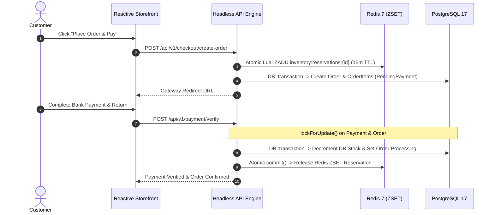

# 🌿 Reyhan Commerce — Framework Architecture & Technical Specification

This document is the official architectural specification for the **Reyhan Commerce Framework** — an enterprise-scale, full-stack, headless, and modular e-commerce engine designed for high-concurrency resilience, sovereign customizability, and seamless zero-breaking upgrades.

---

## 🏛️ 1. Modular Monorepo & Package Anatomy

Reyhan distributes independent, production-grade packages alongside full-featured reference applications:

```text
reyhan/
├── packages/
│   ├── core/                        # 🟢 Headless Domain Engine (Composer Package)
│   │   ├── src/
│   │   │   ├── Actions/             # Single-responsibility domain action classes
│   │   │   ├── Contracts/Models/    # Domain interfaces (OrderContract, ProductContract, ...)
│   │   │   ├── Data/                # Strongly-typed Data Transfer Objects (DTOs)
│   │   │   ├── Models/              # Native Eloquent entities (swappable via Reyhan::model())
│   │   │   ├── Services/            # Inventory, Pricing, OTP, SMS & Payment Managers
│   │   │   └── Support/Modules/     # Dynamic PSR-4 extension discovery autoloader
│   │   ├── database/migrations/     # PostgreSQL 17 JSONB schemas & GIN indices
│   │   └── composer.json            # Package auto-discovery manifest
│   │
│   ├── storefront/                  # 🎨 Reactive Storefront Layer (NPM Package)
│   │   ├── app/
│   │   │   ├── components/          # Cascading e-commerce UI components
│   │   │   ├── composables/         # Reactive hooks (useShopLocale, useApi, usePersian)
│   │   │   ├── layouts/             # Default, checkout, and invoice layouts
│   │   │   ├── pages/               # Catalog, PDP, Checkout, Profile, Wishlist, Returns
│   │   │   └── stores/              # Pinia state stores (cart, auth, checkout, catalog)
│   │   ├── nuxt.config.ts           # Storefront layer configuration
│   │   └── package.json             # NPM package specification
│   │
│   └── create-reyhan/               # 🛠️ Official CLI Scaffolder
│       ├── bin/index.js             # Interactive Clack-powered wizard
│       └── package.json             # NPM executable package
│
├── backend/                         # Reference Backend API & Admin Console
├── frontend/                        # Reference Reactive Storefront
└── docs/                            # Official Documentation Portal
```

---

## 🛠️ 2. Technology Stack & Infrastructure Foundation

| Layer | Technology | Architectural Role & Implementation Details |
| :--- | :--- | :--- |
| **Backend Engine** | **PHP 8.4+ & Laravel 13** | Implements the single-use-case Action pattern, strongly-typed DTOs (`spatie/laravel-data`), native Eloquent persistence, FormRequest validation, and asynchronous queue workers. |
| **Admin Backoffice** | **Filament 5 & Livewire 3** | Interactive management console with fine-grained RBAC permissions (`filament-shield`), real-time websocket updates, and Activitylog audit timelines. |
| **Storefront Layer** | **Nuxt 4 & Vue 3** | Server-Side Rendering (SSR), Composition API, Pinia stores, Reka UI headless accessible primitives, and Tailwind 4 tokens. |
| **Primary Database** | **PostgreSQL 17+** | Native JSONB variant matrices, GIN indexing, `pg_trgm` fuzzy text matching, and pessimistic database locking (`lockForUpdate`). |
| **Memory & Mutex Engine** | **Redis 7+** | Sub-millisecond cart caching, distributed sessions, Horizon queue workers, and atomic Lua script stock reservation mutexes. |
| **High-Performance Runtime** | **FrankenPHP Octane & Caddy** | Worker-mode execution for ultra-low latency and automated TLS certificate handling. |
| **Testing & Quality Assurance** | **Pest 4 & Vitest** | End-to-end domain feature testing, concurrency assertions, architecture linting, and automated UI unit testing. |

---

## 🔒 3. Concurrency, Stock Locking & Financial Integrity

Reyhan implements a battle-tested **Two-Tier Concurrency Architecture**:



1. **Tier 1 (Redis Sorted Sets with Self-Purging Expiration):**
   - Stock reservations are stored as `member = "reservationId:quantity"` with `score = expireTimestamp`.
   - Expired reservations are automatically pruned in every check and reservation call via atomic Lua scripts without leaving ghost locks.
2. **Tier 2 (PostgreSQL Pessimistic Locking):**
   - In `VerifyPaymentAction` and `ApproveCardTransferReceiptAction`, rows are locked using `lockForUpdate()` to eliminate race conditions, double-decrements, or duplicate verification webhooks.
3. **Anti-Brute-Force OTP Protection:**
   - OTP codes enforce a maximum of 5 verification attempts. Exceeding the threshold immediately invalidates the OTP token and triggers a 15-minute lockout period.

---

## 🧩 4. Sovereign Extensibility: Zero Core Modification

### A. Dynamic Model Swapping (`Reyhan::model()`)
Core actions and services interact with Eloquent entities through contracts and the `Reyhan::model()` resolver. To override any core model:

1. Create your custom model extending the base model:
   ```php
   namespace App\Models;

   use Reyhan\Core\Contracts\Models\OrderContract;
   use Reyhan\Core\Models\Order as BaseOrder;

   class CustomOrder extends BaseOrder implements OrderContract
   {
       public function customLoyaltyPoints(): int
       {
           return (int) ($this->final_payable * 0.05);
       }
   }
   ```
2. Bind the custom class in `config/reyhan.php`:
   ```php
   'models' => [
       'order' => \App\Models\CustomOrder::class,
   ],
   ```

### B. Dynamic PSR-4 Plugin Architecture (`backend/extensions/`)
Drop self-contained extensions inside `extensions/{plugin-name}/` with a `module.json` or `composer.json`. `ModuleManager` dynamically injects the extension namespace into Composer's `ClassLoader` and registers its `ServiceProvider` at runtime.

---

## 🌐 5. Storefront Layering & Cascading Architecture

Storefronts consume `@reyhan-commerce/storefront` as a modular layer:

```ts
// frontend/nuxt.config.ts
export default defineNuxtConfig({
  extends: ['@reyhan-commerce/storefront'],
  
  // Custom store-specific configuration
  app: {
    head: {
      title: 'My Custom Store'
    }
  }
})
```

- **Cascading Component Overrides:** Drop a component with the same name into `components/` to seamlessly override the core implementation.
- **Dynamic Localization & RTL:** `useShopLocale` synchronizes HTML `dir="rtl"` / `dir="ltr"`, locale cookies, parameter interpolation (`{name}`), and API `Accept-Language` headers automatically.

---

## 🛠️ 6. Central CLI Orchestrator (`./reyhan`)

| Command | Purpose |
| :--- | :--- |
| `./reyhan doctor` | Deep diagnostic of PostgreSQL 17, Redis 7, runtime extensions, and Node.js environment |
| `./reyhan install` | Local environment provisioning (Migrations, encryption keys, seeders, symlinks) |
| `./reyhan install --prod` | Automated VPS production deployment (Worker-mode runtime, Docker, Caddy SSL) |
| `./reyhan update` | Safe rolling update: automated DB snapshot, migrations, admin upgrades, cache optimization |
| `./reyhan dev` | Concurrent boot of backend API and storefront dev servers |

---

<div align="center">
  <sub>Released under the MIT License. Copyright © 2026 Reyhan Commerce.</sub>
</div>
