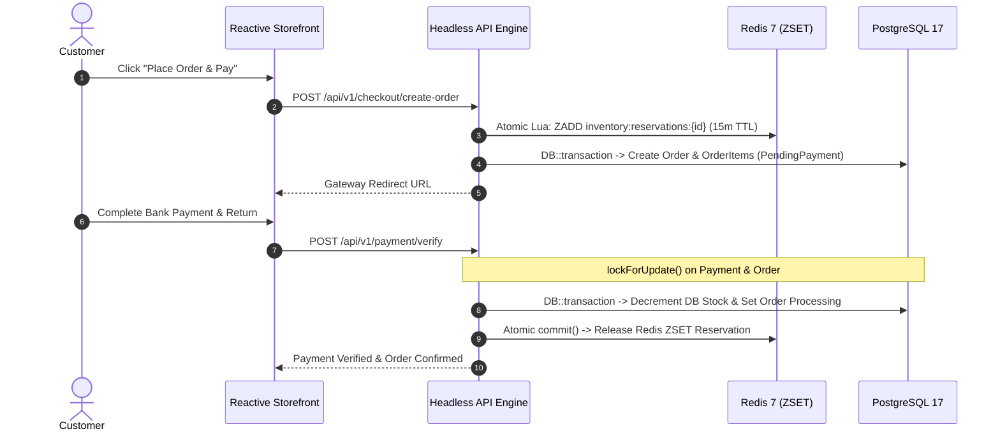

# 🌿 Reyhan Commerce — Framework Architecture & Technical Specification

This document is the official architectural specification for the **Reyhan Commerce Framework** — an enterprise-scale, full-stack, headless, and modular e-commerce engine designed for high-concurrency resilience, sovereign customizability, and seamless zero-breaking upgrades.

---

## 🏛️ 1. Architecture & Ecosystem Anatomy

Reyhan provides a pure, decoupled headless e-commerce architecture divided into specialized repositories:

```text
Ecosystem Overview:
├── reyhan-commerce/core             # 🟢 Headless Domain Engine (Composer Package)
│   ├── src/                         # Facades, Pipelines, Actions, Contracts, Models, Services
│   ├── database/migrations/         # PostgreSQL 17 JSONB schemas & GIN indices
│   └── composer.json                # Package auto-discovery manifest
│
├── reyhan-commerce/reyhan           # 🚀 Application Starter Skeleton (This Repository)
│   ├── app/                         # Userland Actions, Providers, Filament Resources
│   ├── config/                      # Application & Reyhan driver configurations
│   ├── extensions/                  # Modular plugin extensions (PSR-4)
│   ├── tests/                       # Pest 4 test suite
│   ├── artisan                      # Command line interface
│   └── composer.json                # Application dependencies (requires reyhan-commerce/core)
│
├── reyhan-commerce/installer        # 🛠️ Composer-Native CLI Scaffolder (`reyhan new`)
└── reyhan-commerce/storefront-nuxt  # 🎨 Decoupled Nuxt 4 Storefront (Tailwind 4, Pinia)
```

---

## 🛠️ 2. Technology Stack & Infrastructure Foundation

| Layer | Technology | Architectural Role & Implementation Details |
| :--- | :--- | :--- |
| **Backend Engine** | **PHP 8.4+ & Laravel 13** | Implements the single-use-case Action pattern, strongly-typed DTOs (`spatie/laravel-data`), native Eloquent persistence, FormRequest validation, and asynchronous queue workers. |
| **Admin Backoffice** | **Filament 5 & Livewire 3** | Interactive management console with fine-grained RBAC permissions (`filament-shield`), real-time websocket updates, and Activitylog audit timelines. |
| **Domain Facades & Pipelines** | **Custom Engine** | First-class facades (`Cart`, `Pricing`, `Inventory`, `Checkout`, `Ledger`) and hookable computation pipelines. |
| **Primary Database** | **PostgreSQL 17+** | Native JSONB variant matrices, GIN indexing, `pg_trgm` fuzzy text matching, and pessimistic database locking (`lockForUpdate`). |
| **Memory & Mutex Engine** | **Redis 7+** | Sub-millisecond cart caching, distributed sessions, Horizon queue workers, and atomic Lua script stock reservation mutexes. |
| **High-Performance Runtime** | **FrankenPHP Octane & Caddy** | Worker-mode execution for ultra-low latency and automated TLS certificate handling. |
| **Testing & Quality Assurance** | **Pest 4** | End-to-end domain feature testing, concurrency assertions, architecture linting, and automated workflow tests. |

---

## 🔒 3. Concurrency, Stock Locking & Financial Integrity

Reyhan implements a battle-tested **Two-Tier Concurrency Architecture**:



1. **Tier 1 (Redis Sorted Sets with Self-Purging Expiration):**
   - Stock reservations are stored as `member = "reservationId:quantity"` with `score = expireTimestamp`.
   - Expired reservations are automatically pruned in every check and reservation call via atomic Lua scripts without leaving ghost locks.
2. **Tier 2 (PostgreSQL Pessimistic Locking):**
   - In `VerifyPaymentAction` and `ApproveCardTransferReceiptAction`, rows are locked using `lockForUpdate()` to eliminate race conditions, double-decrements, or duplicate verification webhooks.
3. **Anti-Brute-Force OTP Protection:**
   - OTP codes enforce a maximum of 5 verification attempts. Exceeding the threshold immediately invalidates the OTP token and triggers a 15-minute lockout period.

---

## 🧩 4. Sovereign Extensibility: Zero Core Modification

### A. Dynamic Model Swapping (`Reyhan::model()`)
Core actions and services interact with Eloquent entities through contracts and the `Reyhan::model()` resolver. To override any core model:

1. Create your custom model extending the base model:
   ```php
   namespace App\Models;

   use Reyhan\Core\Contracts\Models\OrderContract;
   use Reyhan\Core\Models\Order as BaseOrder;

   class CustomOrder extends BaseOrder implements OrderContract
   {
       public function customLoyaltyPoints(): int
       {
           return (int) ($this->final_payable * 0.05);
       }
   }
   ```
2. Bind the custom class in `config/reyhan.php`:
   ```php
   'models' => [
       'order' => \App\Models\CustomOrder::class,
   ],
   ```

### B. Dynamic PSR-4 Plugin Architecture (`extensions/`)
Drop self-contained extensions inside `extensions/{plugin-name}/` with a `composer.json` extending `ReyhanExtensionServiceProvider`. `ModuleManager` dynamically injects the extension namespace into Composer's `ClassLoader` and registers its `ServiceProvider` at runtime.

---

## 🌐 5. Decoupled Storefront Architecture

Reyhan operates as a pure headless backend API server exposing high-concurrency endpoints and OpenAPI 3.1 interactive contracts:

- **Interactive Documentation**: Available out of the box at `/docs/api` (powered by Scramble).
- **Official Nuxt 4 Storefront**: Maintained in the dedicated [storefront-nuxt](https://github.com/reyhan-commerce/storefront-nuxt) repository with Tailwind 4 design tokens, Pinia stores, and bidirectional RTL/LTR support.
- **Any Client Support**: Works with Next.js, Flutter, React Native, iOS/Android native apps, or IoT checkouts.
- **Dynamic Localization & RTL:** `useShopLocale` synchronizes HTML `dir="rtl"` / `dir="ltr"`, locale cookies, parameter interpolation (`{name}`), and API `Accept-Language` headers automatically.

---

## 🛠️ 6. Central CLI Orchestrator (`./reyhan`)

| Command | Purpose |
| :--- | :--- |
| `./reyhan doctor` | Deep diagnostic of PostgreSQL 17, Redis 7, runtime extensions, and Node.js environment |
| `./reyhan install` | Local environment provisioning (Migrations, encryption keys, seeders, symlinks) |
| `./reyhan install --prod` | Automated VPS production deployment (Worker-mode runtime, Docker, Caddy SSL) |
| `./reyhan update` | Safe rolling update: automated DB snapshot, migrations, admin upgrades, cache optimization |
| `./reyhan dev` | Concurrent boot of backend API and storefront dev servers |

---

<div align="center">
  <sub>Released under the MIT License. Copyright © 2026 Reyhan Commerce.</sub>
</div>
