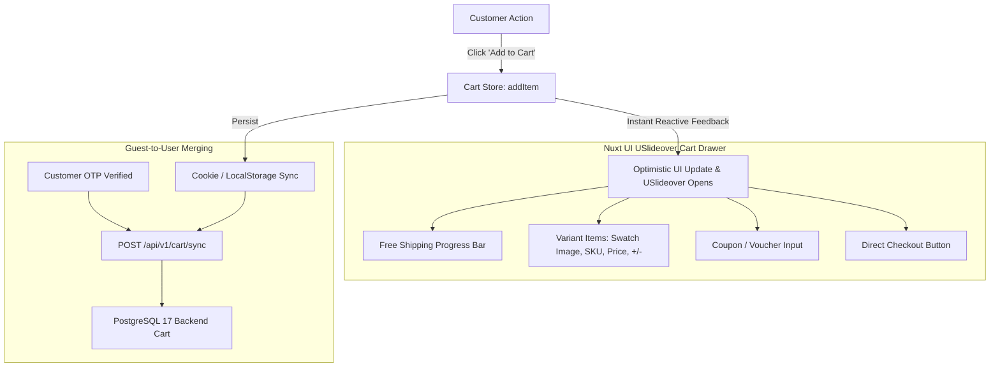

# Reyhan Commerce — Storefront Technical Specification & Architecture Guide

This document defines the comprehensive frontend architecture, design system tokens, component guidelines, user experience standards, and implementation roadmap for the reactive storefront layer of the **Reyhan Commerce** framework.

---

## 1. Core Technology Stack & Package Ecosystem

| Component / Library | Version / Source | Purpose & Architectural Role |
| :--- | :--- | :--- |
| **Framework** | **Nuxt 4** | Full-stack Vue framework providing Server-Side Rendering (SSR) for Core Web Vitals and SEO |
| **UI Library & Components** | **Nuxt UI (Latest Stable)** | Built on Reka UI & Tailwind CSS v4, delivering 125+ accessible, headless components |
| **CSS Framework** | **Tailwind CSS v4** | Next-generation Oxide compiler with CSS-first `@import "tailwindcss";` and `@theme` tokens |
| **Programming Language** | **TypeScript 7.x** | Enterprise strict type safety (`strict: true`) matching backend DTOs |
| **Design System Intelligence** | **`ui-ux-pro-max` Skill** | Mandatory UI/UX framework for touch ergonomics, accessibility, and visual polish |
| **Nuxt UI AI Intelligence** | **`nuxt-ui` MCP & Skill** | Direct AI integration for component metadata, props, slots, and accessible patterns |
| **State Management** | **Pinia** | Centralized reactive stores for Cart, Authentication, Wishlist, and Checkout |
| **Theme Engine** | `@nuxtjs/color-mode` | Native Dark / Light / System theme switching with cookie persistence and zero-flash hydration |
| **Full SEO Ecosystem** | [`@nuxtjs/seo`](https://github.com/harlan-zw/nuxt-seo) | Complete Harlan-Zw suite: Sitemap, Robots, Schema.org, OpenGraph Image Generation |
| **Image Optimization** | `@nuxt/image` | Automatic WebP/AVIF compression, lazy loading, and responsive product galleries |
| **Typography** | **Vazirmatn** | Clean, highly legible Persian web typography across all display and body elements |
| **Form Validation** | **Vee-Validate + Zod** | Type-safe schema validation integrated into `<UForm>` with Persian error feedback |
| **AI & Agent Integration** | `llms.txt` + JSON-LD | Structured metadata and endpoints optimized for AI agents and autonomous shopping crawlers |

---

## 2. Universal Design & UX Standards (`ui-ux-pro-max` Skill)

The frontend mandates the use of the **`ui-ux-pro-max`** design intelligence skill (`/home/farshid/.gemini/antigravity/skills/ui-ux-pro-max/`) to guarantee an interface so intuitive and frictionless that both children and elderly individuals can navigate, select items, and complete orders with complete confidence.

### 2.1. Core Ergonomics & Usability Rules
1. **Touch Ergonomics & Accessibility (WCAG 2.1 AA Compliant)**:
   - **Minimum Touch Target**: All interactive controls, swatch buttons, quantity toggles, and CTA buttons are strictly $\ge 48 \times 48\text{ px}$ with at least $8\text{px}$ padding separation.
   - **High-Contrast Readability**: Strict 4.5:1 minimum text-to-background contrast ratio in both Light and Dark themes.
   - **Keyboard & Screen Reader Navigable**: Fully accessible focus rings, semantic labels, and `aria-live` announcements for real-time cart mutations.
2. **Extreme Simplicity (Cognitive Ease)**:
   - Zero multi-step registration forms: Authentication requires only a single Iranian mobile number + 5-digit OTP PIN input.
   - Reassuring visual feedback: Instant toast notifications (`useToast()`) with clear Persian messages and color-coded status badges.

---

## 3. Strict Component Adoption & "Zero Custom CSS" Rules

To ensure performance, maintainability, and visual consistency, all developers and AI agents must adhere to the following hard rules:

### 3.1. Maximized Nuxt UI Component Adoption
- Never reinvent the wheel with custom HTML boilerplate when a native Nuxt UI component exists:
  - **Root Wrapper**: Wrap the entire application inside `<UApp>` in `app.vue` to power global overlays, toasts, and tooltips.
  - **Cart Drawer**: `<USlideover>` for smooth slide-over bag previews.
  - **Modals & Dialogs**: `<UModal>` for login OTP and address selectors.
  - **Forms**: `<UForm>` bound to Zod schemas with `<UInput>`, `<UPinInput>` (for 5-digit OTP codes), `<USelect>`, and `<UButton>`.
  - **Interactive Elements**: `<UBadge>` (for discount percentages, cruelty-free flags), `<UCard>`, `<UTabs>`, `<UAccordion>` (for product specifications & FAQs).
  - **Toasts**: Native `useToast()` composable.

### 3.2. Pure Tailwind CSS v4 Utility Classes (Zero Custom CSS)
- **Hard Rule**: Writing raw CSS classes inside `<style>` tags (e.g., `.custom-card { ... }`) is strictly prohibited.
- All styling must be achieved exclusively through:
  1. Tailwind CSS v4 utility classes (`flex items-center gap-4 text-sm font-medium rounded-2xl ...`).
  2. Nuxt UI semantic tokens (`bg-default`, `bg-elevated`, `text-default`, `border-muted`).

---

## 4. Dark and Light Mode Architecture

The theme engine operates seamlessly with `@nuxtjs/color-mode` integrated directly through Nuxt UI:

- **Light Mode (Day)**:
  - Background: Crisp pearl white (`#FFFFFF`) with warm cream undertones (`#FFFDFB`).
  - Primary Accent: Luxurious berry/rose (`#E11D48` / `#BE185D`) matching luxury cosmetic branding.
  - Text: Slate charcoal (`#0F172A`) ensuring maximum legibility.
- **Dark Mode (Night)**:
  - Background: Deep slate/zinc (`#09090B` / `#0F172A`), mitigating eye strain in low-light environments.
  - Card Surfaces: Charcoal elevate (`#18181B`).
  - Accent: Vibrant rose neon (`#FB7185`), making lip swatches and buttons pop brilliantly.
- **Zero-Flash Hydration**: The active theme is stored in a cookie (`nuxt-color-mode`) evaluated server-side, preventing flash-of-unstyled-content (FOUC).

---

## 5. Modern Shopping Cart Architecture (`useCartStore`)

The shopping cart is designed with a frictionless, high-converting UX:



### 5.1. Cart Features
1. **Slide-Over Drawer (`USlideover`)**:
   - Clicking "Add to Cart" smoothly slides out the cart from the right (RTL direction) without full-page navigation.
2. **Dynamic Free Shipping Progress Bar**:
   - Visual meter demonstrating progress towards free delivery:
     $$\text{Remaining} = \max(0, \text{Threshold} - \text{Subtotal})$$
     Displays motivating Persian copy (e.g., *«تنها ۱۲۰,۰۰۰ تومان دیگر تا ارسال رایگان!»*).
3. **Optimistic Quantity Updates & Debounce**:
   - Increments and decrements respond instantaneously in the UI while network requests are debounced by 300ms to preserve API bandwidth.
4. **Persistent Guest Cart & Post-Login Merging**:
   - Guest visitors retain their cart in cookies. Upon successful OTP verification, `POST /api/v1/cart/sync` sends local variant IDs and quantities to merge with any existing server-side cart.

---

## 6. Responsive Breakpoint Layouts (Mobile, Tablet, Desktop)

The layout strictly implements a **Mobile-First Responsive Strategy**:

```text
┌────────────────────────────────────────────────────────────────────────┐
│ MOBILE (< 640px)                                                       │
│ ├─ Sticky Top Bar (Brand, Search trigger, Cart icon)                   │
│ ├─ Vertical Single/Double Product Grid                                 │
│ ├─ Bottom Navigation Bar (Home, Categories, Cart, Profile)            │
│ └─ Sticky Product Add-to-Cart Bar on Product Detail Page               │
├────────────────────────────────────────────────────────────────────────┤
│ TABLET (640px - 1024px)                                                │
│ ├─ Adaptive 2 or 3 Column Catalog Grid                                │
│ ├─ Filter Drawer with touch-friendly accordion filters                │
│ └─ Header with quick-search dropdown                                   │
├────────────────────────────────────────────────────────────────────────┤
│ DESKTOP (> 1024px)                                                     │
│ ├─ Sticky Header + Rich Cascading Mega-Menu with cosmetic categories  │
│ ├─ Fixed Left/Right Filter Sidebar with multi-select facets            │
│ ├─ 4 or 5 Column Product Grid with hover quick-view                   │
│ └─ Deep Zoom media viewer on skin texture swatches                     │
└────────────────────────────────────────────────────────────────────────┘
```

---

## 7. Interactive Variant Selector Engine

The product detail page (`pages/products/[slug].vue`) evaluates the scoped availability matrix returned by Laravel's `ProductResource`:

```vue
<!-- components/catalog/VariantSelector.vue -->
<script setup lang="ts">
import type { ProductAttribute, ProductVariant } from '~/types/product'

const props = defineProps<{
  attributes: ProductAttribute[]
  variants: ProductVariant[]
}>()

const emit = defineEmits<{
  (e: 'change', variant: ProductVariant | null): void
}>()

const selectedValues = ref<Record<string, number>>({})

// Computed active variant matching selected attribute IDs
const activeVariant = computed<ProductVariant | null>(() => {
  const selectedIds = Object.values(selectedValues.value)
  if (selectedIds.length !== props.attributes.length) return null

  return props.variants.find(v =>
    selectedIds.every(id => v.attribute_value_ids.includes(id))
  ) ?? null
})

watch(activeVariant, (variant) => {
  emit('change', variant)
}, { immediate: true })

// Helper to determine if an attribute value is valid given current selections
function isOptionValid(attributeCode: string, valueId: number): boolean {
  const otherSelectedIds = Object.entries(selectedValues.value)
    .filter(([code]) => code !== attributeCode)
    .map(([, id]) => id)

  return props.variants.some(v =>
    v.attribute_value_ids.includes(valueId) &&
    otherSelectedIds.every(id => v.attribute_value_ids.includes(id)) &&
    v.is_available
  )
}
</script>

<template>
  <div class="space-y-6">
    <div v-for="attr in attributes" :key="attr.code" class="space-y-2">
      <label class="text-sm font-semibold text-slate-800 dark:text-slate-100 flex items-center justify-between">
        <span>{{ attr.name }}:</span>
        <span class="text-rose-600 dark:text-rose-400 font-medium">
          {{ attr.values.find(v => v.id === selectedValues[attr.code])?.label }}
        </span>
      </label>

      <!-- Color Swatches with High Ergonomic Hitboxes (>= 48px) -->
      <div v-if="attr.code === 'color'" class="flex flex-wrap gap-3">
        <button
          v-for="val in attr.values"
          :key="val.id"
          type="button"
          :disabled="!isOptionValid(attr.code, val.id)"
          :class="[
            'relative w-12 h-12 rounded-full border-2 transition-all flex items-center justify-center',
            selectedValues[attr.code] === val.id ? 'border-rose-600 ring-2 ring-rose-300 dark:ring-rose-800 scale-105' : 'border-slate-300 dark:border-slate-700',
            !isOptionValid(attr.code, val.id) ? 'opacity-25 cursor-not-allowed line-through' : 'cursor-pointer hover:scale-110 active:scale-95'
          ]"
          :style="{ backgroundColor: val.hex }"
          :aria-label="val.label"
          @click="selectedValues[attr.code] = val.id"
        >
          <UIcon v-if="selectedValues[attr.code] === val.id" name="i-heroicon-check-20-solid" class="text-white drop-shadow" />
        </button>
      </div>

      <!-- Button Pills for Size / Volume / Finish (>= 48px height) -->
      <div v-else class="flex flex-wrap gap-2">
        <button
          v-for="val in attr.values"
          :key="val.id"
          type="button"
          :disabled="!isOptionValid(attr.code, val.id)"
          :class="[
            'min-h-[48px] px-5 py-2.5 rounded-xl text-sm border font-medium transition-all flex items-center justify-center',
            selectedValues[attr.code] === val.id
              ? 'bg-rose-50 border-rose-600 text-rose-700 dark:bg-rose-950/50 dark:text-rose-300 dark:border-rose-500 shadow-sm'
              : 'border-slate-200 dark:border-slate-800 text-slate-700 dark:text-slate-200 hover:border-slate-300',
            !isOptionValid(attr.code, val.id) ? 'opacity-30 cursor-not-allowed line-through' : 'cursor-pointer'
          ]"
          @click="selectedValues[attr.code] = val.id"
        >
          {{ val.label }}
        </button>
      </div>
    </div>
  </div>
</template>
```

---

## 8. SEO Suite with Harlan-Zw Ecosystem (`@nuxtjs/seo`)

The platform integrates the unified **Nuxt SEO** package (`@nuxtjs/seo`):

### 8.1. Module Configuration (`nuxt.config.ts`)
```typescript
export default defineNuxtConfig({
  modules: [
    '@nuxt/ui',
    '@nuxt/image',
    '@pinia/nuxt',
    '@nuxtjs/seo',
  ],

  typescript: {
    strict: true,
    typeCheck: true,
  },

  site: {
    url: 'https://reyhan.ir',
    name: 'فروشگاه اینترنتی ریحان',
    description: 'خرید اینترنتی انواع محصولات با تضمین اصالت کالا و ارسال سریع.',
    defaultLocale: 'fa',
  },

  seo: {
    redirectToCanonicalSiteUrl: true,
  },

  schemaOrg: {
    currency: 'IRT',
  },
})
```

### 8.2. Automated Social Cards (`nuxt-og-image`)
Every product detail page dynamically generates high-resolution OpenGraph cards (complete with product imagery, title in Vazirmatn font, and price tag) for rich preview sharing across Telegram, WhatsApp, and Eitaa.

---

## 9. Schema.org Rich Structured Data & AI Agent Readiness

### 9.1. Google Rich Snippets (`useSchemaOrg`)
```typescript
// In pages/products/[slug].vue
useSchemaOrg([
  defineProduct({
    name: product.name,
    description: product.description,
    image: product.primary_image,
    sku: activeVariant.value?.sku ?? product.slug,
    brand: {
      '@type': 'Brand',
      name: product.brand.name,
    },
    offers: [
      {
        '@type': 'Offer',
        price: activeVariant.value?.sale_price ?? activeVariant.value?.price,
        priceCurrency: 'IRT',
        availability: (activeVariant.value?.stock ?? 0) > 0
          ? 'https://schema.org/InStock'
          : 'https://schema.org/OutOfStock',
        itemCondition: 'https://schema.org/NewCondition',
        url: useRequestURL().href,
      },
    ],
    aggregateRating: product.reviews_count > 0 ? {
      '@type': 'AggregateRating',
      ratingValue: product.rating,
      reviewCount: product.reviews_count,
    } : undefined,
  }),
  defineBreadcrumb([
    { name: 'خانه', item: '/' },
    { name: product.category.name, item: `/category/${product.category.slug}` },
    { name: product.name },
  ]),
])
```

### 9.2. AI & Autonomous Agent Readiness (`llms.txt`)
To allow LLMs and autonomous shopping agents to crawl and analyze products cleanly:
- **`public/llms.txt`**: Standard manifest providing direct links to catalog endpoints and category schemas in plain markdown.
- **Semantic ARIA Landmarks**: Every interactive component includes `data-testid`, `role`, and `aria-label` ensuring browser-based AI agents can navigate, select shade swatches, and trigger checkout seamlessly.

---

## 10. Directory Layout (`frontend/`)

```text
frontend/
├── app/
│   ├── app.vue                   # Root element wrapping <UApp> with RTL, dark mode & toasts
│   ├── router.options.ts         # Smooth scroll behavior and route transitions
├── assets/
│   ├── css/
│   │   └── main.css              # @import "tailwindcss"; + Vazirmatn font imports
│   └── fonts/                    # Self-hosted Vazirmatn variable fonts
├── components/                   # Modular, accessible Nuxt UI components
│   ├── common/                   # QuantityInput, PersianPrice, LoadingSpinner
│   ├── auth/                     # OtpModal, CaptchaWidget, MobileInput
│   ├── catalog/                  # ProductCard, VariantSelector, FilterDrawer, BeautyZoom
│   ├── cart/                     # CartSlideover, CartSummary, FreeShippingBar
│   └── checkout/                 # Stepper, AddressPicker, GatewaySelector
├── composables/                  # Reusable Composition API logic
│   ├── useApi.ts                 # Unified fetch client with Sanctum integration
│   ├── useAuth.ts                # OTP login flow, token persistence
│   ├── useCart.ts                # Cart manipulation, optimistic updates
│   ├── useCaptcha.ts             # Captcha challenge retrieval & refresh
│   └── usePersianCurrency.ts     # Localized Persian Toman/Rial formatting
├── layouts/
│   ├── default.vue               # Global layout (Header, Mega-Menu, Cart Drawer, Footer)
│   ├── checkout.vue              # Distraction-free single-purpose checkout layout
│   └── profile.vue               # User dashboard sidebar navigation layout
├── pages/
│   ├── index.vue                 # Landing page (Banners, flash deals, categories)
│   ├── auth/
│   │   └── login.vue             # Mobile OTP authentication page
│   ├── products/
│   │   ├── index.vue             # Catalog page with search, facets & pagination
│   │   └── [slug].vue            # Rich PDP with VariantSelector & Schema.org
│   ├── checkout/
│   │   ├── index.vue             # Multi-step checkout (Cart -> Address -> Gateway)
│   │   └── callback.vue          # Shetabit bank payment return view
│   └── profile/
│       ├── orders.vue            # Order history with live delivery tracking
│       └── addresses.vue         # Address management with postal code validation
├── public/
│   ├── llms.txt                  # AI agent catalog index
│   └── llms-full.txt             # Detailed AI agent documentation
├── stores/                       # Pinia setup stores
│   ├── auth.ts                   # Token, user state & profile
│   ├── cart.ts                   # Persistent cart state & sync logic
│   ├── wishlist.ts               # Favorited products
│   └── checkout.ts               # Selected address, gateway, invoice state
├── types/                        # TypeScript 7.x interfaces matching Laravel API Resources
│   ├── product.d.ts              # Product, Variant, Attribute, Category
│   ├── order.d.ts                # OrderItem, Invoice, Payment
│   ├── user.d.ts
│   └── api.d.ts
├── nuxt.config.ts                # Nuxt UI, Nuxt Image, Nuxt SEO, Nitro proxy
└── tsconfig.json                 # TypeScript 7.x strict configuration
```

---

## 11. Unified API Client Wrapper (`useApi`)

```typescript
// frontend/composables/useApi.ts
import type { UseFetchOptions } from 'nuxt/app'

interface ApiResponse<T> {
  success: boolean
  message: string
  data: T
  meta: Record<string, unknown>
  errors: Record<string, string[]> | null
}

export function useApi<T>(url: string, options: UseFetchOptions<ApiResponse<T>> = {}) {
  const config = useRuntimeConfig()
  const authStore = useAuthStore()

  const defaults: UseFetchOptions<ApiResponse<T>> = {
    baseURL: config.public.apiBaseUrl,
    headers: {
      Accept: 'application/json',
      ...(authStore.token ? { Authorization: `Bearer ${authStore.token}` } : {})
    },
    onResponseError({ response }) {
      if (response.status === 401) {
        authStore.logout()
        navigateTo('/auth/login')
      }
    }
  }

  return useFetch(url, { ...defaults, ...options })
}
```

---

## 12. Comprehensive Page Map & Route Architecture

Every page is engineered using **Nuxt UI** components and **Tailwind CSS v4** with a strict **RTL & Persian** orientation:

### 12.1. Storefront & Catalog Routes
1. **Homepage (`pages/index.vue`)**:
   - Dynamic Hero Banner Slider (campaigns and discounts).
   - Visual Categories Grid (Skincare, Makeup, Hair, Perfume).
   - Limited-Time Flash Deals Carousel with live countdown timer.
   - Best-Sellers and Top Brands Carousel.
   - Trust and authenticity guarantee badges (Original Guarantee, 7-Day Return Policy, Fast Dispatch).
2. **Catalog / Product Listing (`pages/products/index.vue`)**:
   - Responsive product cards grid with quick-view modal.
   - Filter drawer on mobile (`USlideover`) / sidebar on desktop (`UCard`).
   - Filters: Categories, Dynamic Attributes (Color, Size, Specs, etc.), Brand, Price Slider, In-Stock Only.
   - Sorting: Most Popular, Cheapest, Most Expensive, Newest.
3. **Product Detail Page (`pages/products/[slug].vue`)**:
   - Decoded Persian URL slug support (`decodeURIComponent`).
   - High-resolution product gallery with `@nuxt/image` and deep zoom.
   - Interactive `VariantSelector.vue` (swatches, size pills, stock check).
   - Sticky Add-to-Cart bottom bar on mobile (< 640px).
   - Tabbed section (`UTabs`): Product Overview, Specifications, Details, Reviews.
   - Multi-dimensional verified reviews (`criteria_ratings`, overall score) with "Verified Buyer" badge.
   - Related and complementary products carousel.
4. **Category Map (`pages/categories/index.vue`) & Category Detail (`pages/categories/[slug].vue`)**:
   - Visual category tree with rich imagery for elderly and mobile accessibility.
   - Subcategory scroll pills at the top of category pages.
   - Automatic breadcrumb navigation (`defineBreadcrumb`).

### 12.2. Cart, Checkout & Payment Routes
1. **Slide-Over Bag & Full Cart (`components/cart/CartSlideover.vue` & `pages/cart/index.vue`)**:
   - Itemized list of selected variants with swatch thumbnails and unit prices.
   - Dynamic Free Shipping Progress Bar.
   - Debounced quantity incrementers (`+` / `-`).
   - Coupon code input with live price recalculation.
2. **Checkout Stepper (`pages/checkout/index.vue`)**:
   - Step 1: Address Selection (Stored address picker or `<UModal>` for new Iranian address with postal code validation).
   - Step 2: Shipping Method (Local Express Courier vs. Post Pishtaz / Tipax).
   - Step 3: Gateway Selection (Zarinpal, Saman, Mellat) + Invoice Summary.
   - Primary CTA: Direct redirection to bank gateway.
3. **Payment Return & Receipt (`pages/checkout/callback.vue`)**:
   - Processes callback parameters via `POST /api/v1/payment/verify`.
   - Displays success state with tracking reference, order ID, and printable invoice.
   - Displays failure state with clear Persian explanation and a "Retry Payment" action button.

### 12.3. Customer Profile & Orders Dashboard
1. **Order History & Live Tracking (`pages/profile/orders.vue`)**:
   - Filter by status (`OrderStatus` Enums).
   - Tracking link integration for Iran Post / Courier.
2. **Saved Addresses (`pages/profile/addresses.vue`)**:
   - Manage multiple recipient addresses with province/city dropdowns.
3. **Favorites & Wishlist (`pages/profile/wishlist.vue`)**:
   - Quick-add favorite cosmetic shades to bag.
4. **Account Details (`pages/profile/settings.vue`)**:
   - First name, last name, national code, and optional email.

### 12.4. Dynamic CMS & Static Pages
1. **About Us (`pages/about.vue`)**: Rich story, certifications, and store standards.
2. **Contact Us (`pages/contact.vue`)**: Interactive contact form, phone support, physical address, and map coordinates.
3. **Terms & FAQs (`pages/terms.vue` & `pages/faq.vue`)**: Accordion-based (`UAccordion`) questions on delivery, authenticity, and 7-day return policies.
4. **Dedicated Error Page (`error.vue`)**: Illustrated 404 (Not Found) and 500 (Server Error) with a friendly Persian return button.

---

## 13. Dynamic Backend Store Settings & Persian Localization

### 13.1. Dynamic Store Metadata (`stores/settings.ts`)
The application niemals hardcodes store details. On initial boot (`app.vue`), it invokes `GET /api/v1/app/settings` and caches the payload in Pinia:
```typescript
export interface StoreSettings {
  store_name: string
  store_tagline: string
  logo_light: string
  logo_dark: string
  favicon: string
  support_phone: string
  support_email: string
  physical_address: string
  map_coordinates: { lat: number; lng: number }
  free_shipping_threshold: number
  social_links: {
    instagram?: string
    telegram?: string
    eitaa?: string
    bale?: string
    whatsapp?: string
  }
  trust_badges: {
    enamad_code?: string
    samandehi_code?: string
    health_permit?: string
  }
}
```

### 13.2. Universal RTL & Persian Number Formatting
- Document-level RTL enforced in `app.vue`:
  ```typescript
  useHead({
    htmlAttrs: {
      dir: 'rtl',
      lang: 'fa',
    },
  })
  ```
- Numbers, currencies, and dates are formatted using localized Persian numerals ($0 \to \text{۰}, 1 \to \text{۱}, \dots$) via `usePersianCurrency`:
  ```typescript
  // Formats raw integer 450000 into "۴۵۰,۰۰۰ تومان"
  export function usePersianCurrency() {
    const formatToman = (amount: number): string => {
      const formatted = new Intl.NumberFormat('fa-IR').format(amount)
      return `${formatted} تومان`
    }
    return { formatToman }
  }
  ```

### 13.3. Standardized Error Handling Architecture
- **Validation Errors (HTTP 422)**: Server error field keys match the form state keys, rendering localized Persian error text beneath each `<UInput>` in `<UForm>`.
- **Session Expiry (HTTP 401)**: Intercepted in `useApi.ts`; opens the `<UModal>` login drawer seamlessly without purging the current shopping cart state.
- **Server Errors (HTTP 500 / Offline)**: Triggers a friendly Persian toast alert via `useToast()` reassuring the customer without exposing confusing technical traces.
