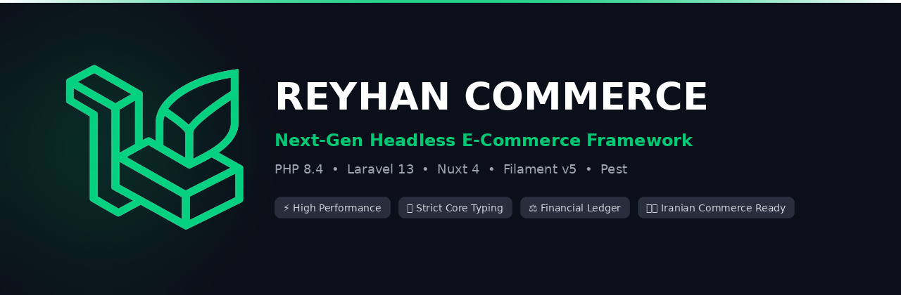

<div align="center">



# 🌿 Reyhan Commerce

### The Sovereign Enterprise Headless E-Commerce Framework
**Engineered for High-Concurrency, Dynamic Extensibility & Zero-Breaking Upgrades**

[](LICENSE)
[](https://reyhan-commerce.github.io/docs/)
[](https://reyhan-commerce.github.io/docs/v1/architecture/lifecycle)
[](https://reyhan-commerce.github.io/docs/)

[**📖 Read Full Documentation**](https://reyhan-commerce.github.io/docs/) • [**🚀 Getting Started**](https://reyhan-commerce.github.io/docs/v1/getting-started/installation) • [**🏛 Architecture**](https://reyhan-commerce.github.io/docs/v1/architecture/lifecycle) • [**🛠 CLI Reference**](https://reyhan-commerce.github.io/docs/v1/cli/cli-reference)

</div>

---

## ⚡ Quick Start

### 1. Official Composer CLI Installer

Scaffold a production-ready Reyhan Commerce backend using our official Composer-native CLI tool:

```bash
composer global require reyhan-commerce/installer
reyhan new my-store
```

### 2. Composer Create-Project

Or install directly via standard Composer:

```bash
composer create-project reyhan-commerce/reyhan my-store
cd my-store
php artisan reyhan:install
```

### 3. Local Development & Orchestrator

Clone this repository and run the central CLI orchestrator:

```bash
# Verify system prerequisites (PostgreSQL 17+, Redis 7+, PHP 8.4+)
./reyhan doctor

# Provision database, encryption keys, and seeders
./reyhan install

# Start backend development server
./reyhan dev
```

---

## 🏛️ Framework Architecture Pillars

1. **Pure Headless Backend Engine:**
   - Distributed via Composer (`reyhan-commerce/core` & `reyhan-commerce/reyhan`).
   - Standard OpenAPI 3.1 contract generation via Scramble at `/docs/api`.
   - Works seamlessly with any frontend technology (Official Nuxt 4 storefront, Next.js, Flutter, React Native, or iOS/Android native apps).
2. **First-Class Domain Facades:**
   - Modern, expressive Laravel facades (`Cart`, `Pricing`, `Inventory`, `Checkout`, `Ledger`, `Reyhan`).
3. **Hookable Commercial Pipelines:**
   - Dynamic, customizable pipes for `CartCalculationPipeline` and `OrderCreationPipeline`.
4. **General Financial Ledger Engine:**
   - Double-entry bookkeeping core (`LedgerService` & `Ledger` facade) enforcing strict debit-credit balance and transaction integrity.
5. **Two-Tier Concurrency & Stock Locking:**
   - Tier 1: Distributed memory Sorted Sets with self-purging TTL to eliminate ghost inventory locks.
   - Tier 2: Database-level pessimistic row locking during checkout payment settlement.
6. **Sovereign Extensibility (Zero Core Modification):**
   - **Dynamic Model Swapping:** Domain workflows resolve entities dynamically through contracts and resolvers.
   - **Dynamic PSR-4 Extensions:** Drop plugins into `extensions/` with automatic classloader namespace injection and `ReyhanExtensionServiceProvider`.

---

## 🛠️ Technology Stack & Architectural Foundation

| Domain | Technology / Engine | Architectural Role & Rationale |
| :--- | :--- | :--- |
| **Backend Engine** | **PHP 8.4+ & Laravel 13** | Implements single-responsibility `final` Action classes, strongly-typed DTOs (`spatie/laravel-data`), native Eloquent models, and robust queue workers. |
| **Admin Backoffice** | **Filament 5 & Livewire 3** | High-productivity reactive admin panel, RBAC permissions (`filament-shield`), real-time websocket updates, and audit logging. |
| **Primary Database** | **PostgreSQL 17+** | Enterprise JSONB variant matrices, GIN indexing, `pg_trgm` fuzzy text search, and ACID pessimistic row-locking (`lockForUpdate`). |
| **Memory & Mutex Engine** | **Redis 7+** | Sub-millisecond cart caching, distributed sessions, Horizon queue workers, and atomic Lua script stock reservations. |
| **High-Performance Runtime** | **FrankenPHP Octane & Caddy** | Worker-mode execution for microsecond response times and automated SSL certificate provisioning. |
| **Testing & Quality Assurance** | **Pest 4** | End-to-end domain feature testing, concurrency assertions, architecture linting, and automated workflow tests. |

---

## 📂 Application Anatomy

```text
reyhan/
├── app/                             # Application Domain Layer & Custom Overrides
│   ├── Actions/                     # Single-responsibility userland action classes
│   ├── Filament/                    # Admin Backoffice resources, pages & dashboards
│   └── Providers/                   # Application service providers
├── bootstrap/                       # Laravel 13 framework bootloader
├── config/                          # Application & Reyhan driver configurations
├── database/                        # Migrations, seeders, and model factories
├── extensions/                      # Isolated custom modular extensions (PSR-4)
├── public/                          # Web server entrypoint & compiled assets
├── routes/                          # Web, API, and console route definitions
├── storage/                         # Application logs, caches, and uploaded assets
├── tests/                           # Pest 4 test suite (Feature, Unit, Architecture)
├── artisan                          # Laravel command-line interface
├── composer.json                    # Application dependencies (reyhan-commerce/core)
├── reyhan                           # Central orchestrator CLI
└── version.json                     # Release & compatibility manifest
```

---

## 🌐 Official Ecosystem Repositories

| Repository | Role | Package Name | Status |
| :--- | :--- | :--- | :--- |
| [**reyhan-commerce/core**](https://github.com/reyhan-commerce/core) | Core Engine Package (Facades, Actions, Pipelines, Models) | `reyhan-commerce/core` | Open Source (MIT) |
| [**reyhan-commerce/reyhan**](https://github.com/reyhan-commerce/reyhan) | Application Skeleton Starter (This Repository) | `reyhan-commerce/reyhan` | Open Source (MIT) |
| [**reyhan-commerce/create-reyhan**](https://github.com/reyhan-commerce/create-reyhan) | Composer-native CLI Scaffolder | `reyhan-commerce/installer` | Open Source (MIT) |
| [**reyhan-commerce/storefront-nuxt**](https://github.com/reyhan-commerce/storefront-nuxt) | Decoupled Nuxt 4 Storefront Layer | `storefront-nuxt` | Official Commercial |
| [**reyhan-commerce/docs**](https://github.com/reyhan-commerce/docs) | Official Documentation Portal | VitePress | Live Online |

---

## 📄 Dedicated Specification Files

- [Framework Architecture (`FRAMEWORK.md`)](./FRAMEWORK.md): Architectural design, concurrency lifecycle, and zero-breaking upgrade guarantees.
- [Backend Technical Specification (`BACKEND.md`)](./BACKEND.md): Detailed backend architecture, PostgreSQL schemas, payment drivers, SMS pipelines, and Pest testing suites.
- [Admin & Plugins Guide (`PLUGINS.md`)](./PLUGINS.md): Admin panel plugins, modular extensions architecture, and evaluation checklists.
- [Execution Roadmap (`ROADMAP.md`)](./ROADMAP.md): Milestone progress and upcoming major features.
- [AI & Coding Agent Standards (`AGENTS.md`)](./AGENTS.md): Strict guidelines and protocol for AI coding assistants.

---

<div align="center">
  <sub>Released under the MIT License. Copyright © 2026 Reyhan Commerce.</sub>
</div>
