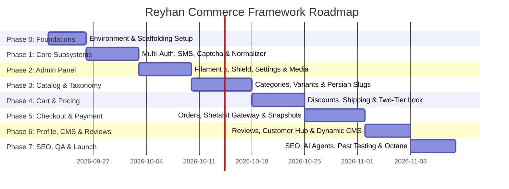

# Reyhan E-Commerce Execution Roadmap & Phased Implementation Plan

This document outlines the structured, milestone-driven execution plan for building the **Reyhan Commerce** headless e-commerce framework across the **Laravel 13** backend and the **Nuxt 4** frontend.

---

## Roadmap Overview & Milestones

---

## Phase 0: Infrastructure, Environment & Repository Scaffolding

**Objective**: Establish the dual-repository structure, core database engines, containerization, and baseline framework configurations.

### 0.1. Backend Infrastructure (`backend/`)
- [x] Initialize Laravel 13 application in `backend/` with PHP 8.5+ strict typing.
- [x] Configure **PostgreSQL 18.4** (`reyhan_db` and `reyhan_db_test` on port 30102) in `config/database.php`, `phpunit.xml`, and `.env`.
- [x] Create initial migration enabling PostgreSQL extensions: `pg_trgm`, `cube`, and `earthdistance`.
- [x] Configure **Redis 8.6** (port 30101) with logical database partitioning:
  - `DB 0`: Cache, Pulse, OTP tokens, Captcha.
  - `DB 1`: User & Admin session store (`SESSION_DRIVER=redis`).
  - `DB 2`: Horizon queue workers (`QUEUE_CONNECTION=redis`).
- [x] Install and configure **Laravel Octane** (FrankenPHP binary).
- [x] Install and configure **Laravel Horizon** and **Laravel Pulse**.
- [x] Configure **Laravel Pint** (PSR-12) and **Larastan** (PHPStan Level 8) with Pest PHP.
- [x] Initialize Git on branch `main` with Phase 0 commit (`12f87ab`).
- [x] Create comprehensive AI & Human documentation: `backend/README.md` and `backend/ARCHITECTURE.md`.

### 0.2. Frontend Infrastructure (`frontend/`)
- [x] Initialize Nuxt 4 application in `frontend/` with Vue 3.
- [x] Configure **TypeScript** with `"strict": true` in `tsconfig.json`.
- [x] Install and configure **Tailwind CSS v4** with CSS-first architecture (`@import "tailwindcss";`).
- [x] Install and configure **Nuxt UI** with Reka UI primitives.
- [x] Configure `@nuxtjs/color-mode` for Dark/Light theme switching.
- [x] Embed and configure **Vazirmatn** variable font (`@fontsource-variable/vazirmatn`) with universal RTL (`dir="rtl"`, `lang="fa-IR"`).
- [x] Configure **Pinia** + `pinia-plugin-persistedstate` and `@vueuse/nuxt`.
- [x] Initialize Git on branch `main` with Phase 0 commit (`d08b8f1`).
- [x] Create comprehensive AI & Human documentation: `frontend/README.md` and `frontend/ARCHITECTURE.md`.

---

## Phase 1: Authentication, Security & Text Normalization Subsystems

**Objective**: Implement customer OTP authentication, admin credential guards, self-hosted visual captcha, and the automated Persian text normalizer pipeline.

### 1.1. Backend Deliverables
- [x] Implement multi-guard configuration in `config/auth.php`:
  - `admin` guard: Eloquent provider for `Admin` model (Session-based).
  - `sanctum` guard: Token-based provider for `User` model.
- [x] Create database migrations:
  - `users` table: `id`, `first_name`, `last_name`, `national_code` (unique, nullable), `mobile` (unique), `email` (nullable), `avatar`, `is_active`, `mobile_verified_at`, `timestamps`, `softDeletes`.
  - `admins` table: `id`, `name`, `email` (unique), `password`, `avatar`, `is_active`, `remember_token`, `timestamps`, `softDeletes`.
- [x] Build **Persian Text Normalization Pipeline** (`app/Pipelines/Normalizer/`):
  - `NormalizeDigitsPipe`: Persian numerals (`۰-۹`) for titles/descriptions; clean ASCII (`0-9`) for phones, IDs, national codes.
  - `NormalizeCharactersPipe`: Unified Arabic/Persian Yehs and Kafs, stripped diacritics.
  - `NormalizeZwnjPipe`: Standard Unicode ZWNJ (`\u200C`) and multi-space cleaner.
- [x] Implement **Self-Hosted Visual Captcha** (`app/Services/Captcha/CaptchaService.php`):
  - Mathematical & high-legibility SVG challenge generation with Redis DB 0 TTL.
  - Endpoint: `GET /api/v1/captcha/generate`.
- [x] Implement **Multi-Driver SMS Engine** (`app/Services/Sms/`):
  - `SmsManager` extending Laravel Manager pattern.
  - Drivers: `LogDriver`, `KavenegarDriver`, `FarazSmsDriver`, `GhasedakDriver`.
  - Asynchronous `SendOtpSmsJob` with Redis queue (`DB 2`).
- [x] Build **Customer OTP Authentication Lifecycle** (`app/Http/Controllers/Api/V1/AuthController.php`):
  - Redis rate limiting (maximum 1 request per 120 seconds per mobile).
  - Cryptographic 5-digit token in Redis DB 0 with 120s TTL.
  - Endpoints: `POST /api/v1/auth/otp/request`, `POST /api/v1/auth/otp/verify`, `POST /api/v1/auth/logout`, `GET /api/v1/auth/me`.
  - Complete Pest functional test suite (`tests/Feature/Auth/OtpAuthTest.php`).
- [x] Create base `UserResource` for API serialization.

### 1.2. Frontend Deliverables
- [x] Implement `frontend/app/composables/useApi.ts` wrapping `$fetch` with Sanctum token attachment and unified 401/422/500 error toast alerts.
- [x] Build `frontend/app/stores/auth.ts` managing token storage, profile state, OTP request/verify actions, and SSR cookie persistence.
- [x] Construct `<UApp>` root wrapper in `app/app.vue` with user auth header dropdown and global `<AuthModal />`.
- [x] Build reusable `CaptchaInput.vue` with SVG rendering and instant refresh capabilities.
- [x] Build mobile-friendly OTP Login Modal (`app/components/auth/AuthModal.vue`) with 120-second countdown timer and accessibility compliance ($\ge 48\times 48\text{px}$ targets).
- [x] Create route protection middleware `app/middleware/auth.ts`.

---

## Phase 2: Administrative Control Panel & Dynamic Store Settings

**Objective**: Deploy a localized, Persian-first Filament 5 admin panel with role-based access control, encrypted settings, and media management.

### 2.1. Backend & Admin Deliverables
- [x] Configure **Filament 5 Admin Panel** restricted strictly to the `admin` guard.
- [x] Set default panel locale to Persian (`fa`) with native RTL direction.
- [x] Integrate **Filament Shield** with `spatie/laravel-permission` for fine-grained staff roles (`SuperAdmin`, `ShopManager`, `InventorySpecialist`, `CustomerSupport`).
- [x] Integrate **Spatie Laravel Settings** with `filamentphp/spatie-laravel-settings-plugin`:
  - `SmsSettings`: Active driver selector + encrypted API keys and sender lines.
  - `PaymentSettings`: Active gateway selector + encrypted merchant secrets.
  - `GeneralSettings`: Store name, logo, contact info, free shipping threshold, social links, and trust badges.
- [x] Integrate **Spatie Media Library** with `filamentphp/spatie-laravel-media-library-plugin` (auto WebP conversion, responsive image generation).
- [x] Integrate **Filament Backup** plugin (`shuvroroy/filament-spatie-laravel-backup`) with `pg_dump` UTF-8 preservation.
- [x] Integrate Shamsi calendar pickers and column formatters (`morilog/jalali`).
- [x] Expose public endpoint `GET /api/v1/app/settings` cached in Redis.

### 2.2. Frontend Deliverables
- [x] Implement `frontend/stores/settings.ts` fetching `GET /api/v1/app/settings` on initial boot.
- [x] Bind dynamic store logos (Light & Dark), title, favicon, and contact links into global header and footer.

---

## Phase 3: Product Catalog, Category Tree & Scoped Variant Engine

**Objective**: Implement the enterprise Product-Variant-Attribute architecture, live Persian slug generation, and the interactive frontend variant selector.

### 3.1. Backend Deliverables
- [x] Create database migrations:
  - `categories`: Self-referencing hierarchical tree (`parent_id`), name, Persian slug, icon, image, order.
  - `attributes` & `attribute_values`: Attribute taxonomy (Color with Hex, Size, Finish, Volume, SPF).
  - `category_attributes`: Pivot defining permitted attributes per category with `is_variant_maker` flag.
  - `brands`: Manufacturer entities.
  - `products`: Parent product entities with `spatie/laravel-sluggable`.
  - `product_variants`: Purchasable SKUs, stock count, prices, barcodes, batch numbers, and expiry dates.
  - `product_variant_values`: Pivot linking variants to attribute values.
- [x] Implement Live Slug Generation in Filament 5 `ProductResource` (real-time Persian slug update on product name input with database uniqueness check).
- [x] Create category tree endpoint: `GET /api/v1/categories/tree` (Redis-cached).
- [x] Create catalog RESTful endpoints:
  - `Route::apiResource('categories', CategoryController::class)->only(['index', 'show'])`.
  - `Route::apiResource('products', ProductController::class)->only(['index', 'show'])`.
- [x] Configure PostgreSQL 17 `pg_trgm` GIN indexes on `products.name` and implement typo-tolerant search in `SearchProductsAction`.
- [x] Ensure `ProductResource` returns scoped attributes and the exact valid `available_variants` matrix.

### 3.2. Frontend Deliverables
- [x] Build **Homepage (`pages/index.vue`)**:
  - Hero campaigns slider.
  - Visual category navigation cards.
  - Flash deals carousel with live countdown timer.
  - Best-sellers and brand carousels.
- [x] Build **Category Pages**:
  - Category Map view (`pages/categories/index.vue`).
  - Category Detail view (`pages/categories/[slug].vue`) with subcategory scroll pills and breadcrumb trails.
- [x] Build **Catalog View (`pages/products/index.vue`)**:
  - Responsive product card grid with quick-view modals.
  - Filter drawer (`USlideover`) on mobile / sidebar (`UCard`) on desktop (skin type, brand, price slider, in-stock toggle).
- [x] Build **Product Detail Page (`pages/products/[slug].vue`)**:
  - Decoded Persian URL slug routing.
  - Deep-zoom media viewer using `@nuxt/image`.
  - Interactive `VariantSelector.vue` component:
    - Live evaluation of `available_variants` matrix.
    - Disables non-existent attribute combinations.
    - Displays out-of-stock strikethroughs and triggers "Notify Me" CTA when stock is zero.
    - Live synchronization of product images with active color swatches.
  - Sticky mobile Add-to-Cart bar with variant preview ($< 640\text{px}$).

---

## 4. Shopping Cart, Pricing Engine & Two-Tier Concurrency Locking

**Objective**: Build a frictionless shopping cart, rule-based coupon engine, dynamic shipping calculation, and two-tier concurrency locking.

### 4.1. Backend Deliverables
- [x] Create database migrations:
  - `carts` & `cart_items`: Cart persistence bound to `product_variant_id`.
  - `coupons`: Rule-based promotions (Percentage, Fixed Amount, Free Shipping) with scope (Order, Categories, Brands, Variants) and usage constraints.
  - `provinces` & `cities`: Iranian administrative divisions with official coordinates (`lat`/`lng`) and postal code prefixes.
- [x] Seed official Iranian provinces and cities data (`IranGeoSeeder`).
- [x] Implement **Pricing Service** (`app/Services/Pricing/`): Calculates subtotals, validates coupons, and applies discount caps.
- [x] Implement **Shipping Service** (`app/Services/Shipping/`): Computes free shipping eligibility, local express courier rates, and national carrier weight-based tiers.
- [x] Implement **Two-Tier Concurrency Locking** (`app/Services/Inventory/`):
  - **Tier 1 (Redis Atomic Lock & Decrement)**: 15-minute temporary reservation with TTL during checkout.
  - **Tier 2 (PostgreSQL Pessimistic Lock)**: `ProductVariant::where('id', $id)->lockForUpdate()` during finalized payment settlement.
- [x] Expose RESTful cart endpoints:
  - `Route::apiResource('cart', CartController::class)->only(['index', 'store', 'destroy'])`.
  - `PUT /api/v1/cart/items/{cartItem}`.
  - `POST /api/v1/cart/sync` (post-login guest cart merging).

### 4.2. Frontend Deliverables
- [x] Build `frontend/stores/cart.ts` with cookie persistence for guest visitors.
- [x] Build modern **Slide-Over Bag (`components/cart/CartSlideover.vue`)** using Nuxt UI `<USlideover>`:
  - Live Free Shipping Progress Bar.
  - Instant optimistic quantity updates (`+` / `-`) with 300ms debounced background API sync.
  - Itemized variant thumbnails, unit prices, and discount badges.
  - Coupon code submission with instant subtotal recalculation.
- [x] Build dedicated Cart page (`pages/cart/index.vue`).
- [x] Implement automatic guest cart merging trigger upon OTP login verification.

---

## 5. Checkout, Bank Payment Gateways & Order Lifecycle

**Objective**: Complete the multi-step checkout sequence, integrate Iranian bank gateways via `shetabit/payment`, and establish immutable order snapshots.

### 5.1. Backend Deliverables
- [x] Create database migrations:
  - `orders`: Order entity, customer reference, shipping address, financial totals, and `OrderStatus` enum.
  - `order_items`: Permanent historical snapshots (`product_name`, `variant_title`, `sku`, `unit_price`, `discount_amount`, `final_price`, `quantity`, `total_price`, `attributes_snapshot` JSONB).
  - `payments`: Transaction records, authority tokens, reference numbers, and `PaymentStatus` enum.
  - `addresses`: Recipient details, province, city, street, postal code, phone.
- [x] Integrate **`shetabit/payment`** with dynamic credential injection from `app(PaymentSettings::class)`:
  - Gateways: Zarinpal, Saman Bank (SEP), Mellat Bank (Behpardakht), Sandbox.
- [x] Implement Checkout Actions:
  - `CreateOrderAction`: Validates cart, locks inventory (Tier 1), generates order and invoice records.
  - `InitiatePaymentAction`: Acquires authority token and returns bank gateway URL.
  - `VerifyPaymentAction`: Verifies transaction signature, commits Tier 2 database stock decrement (`lockForUpdate`), updates order to `PROCESSING`, and invalidates temporary Redis reservation.
- [x] Configure automatic post-purchase SMS confirmation dispatch via `SmsChannel`.
- [x] Expose endpoints:
  - `POST /api/v1/checkout/create-order`.
  - `POST /api/v1/checkout/apply-coupon`.
  - `POST /api/v1/payment/verify`.
  - `Route::apiResource('addresses', AddressController::class)`.
  - `Route::apiResource('orders', OrderController::class)->only(['index', 'show'])`.

### 5.2. Frontend Deliverables
- [x] Build **Checkout Stepper (`pages/checkout/index.vue`)**:
  - Step 1: Address Selection (Saved address picker or `<UModal>` for new address with Iranian postal code validation).
  - Step 2: Shipping Method Selection (Local Express Courier vs. Post Pishtaz / Tipax).
  - Step 3: Gateway Selection + Final Invoice Breakdown.
  - Primary CTA: Direct redirection to bank gateway.
- [x] Build **Payment Callback View (`pages/checkout/callback.vue`)**:
  - Communicates with `POST /api/v1/payment/verify`.
  - Displays success screen with tracking reference, order ID, and printable invoice.
  - Displays failure screen with clear Persian explanation and a "Retry Payment" action button.

---

## 6. Reviews, Customer Dashboard, Static CMS & Media Storage

**Objective**: Deliver authentic multi-dimensional criteria reviews, customer profile management, switchable cloud storage, and dynamic CMS pages.

### 6.1. Backend Deliverables
- [x] Create database migrations:
  - `reviews`: Product reviews with ratings for longevity, coverage, and value; strengths/weaknesses JSONB; moderation status.
- [x] Implement automated Verified Buyer check hook against `order_items`.
- [x] Create Filament 5 moderation workflow for reviews in the admin panel.
- [x] Implement switchable storage configuration:
  - Default: `FILESYSTEM_DISK=public`.
  - S3-compatible configuration ready for MinIO / ArvanCloud / Derak.
  - Create migration Artisan command: `php artisan media:migrate-to-s3`.
- [x] Implement Headless Sitemap Data Endpoint:
  - `GET /api/v1/sitemap/urls` returning active slugs and modification timestamps cached in Redis.
- [x] Expose CMS endpoints: `GET /api/v1/pages/{slug}`.

### 6.2. Frontend Deliverables
- [x] Build **Customer Profile Views**:
  - Order history with status filters and courier tracking (`pages/profile/orders.vue`).
  - Saved address book (`pages/profile/addresses.vue`).
  - Wishlist management (`pages/profile/wishlist.vue`).
  - Profile settings and national code completion (`pages/profile/settings.vue`).
- [x] Build **Multi-Dimensional Review Widget** on PDP:
  - Longevity, Coverage, and Value rating bars.
  - "Verified Buyer" badge.
  - Review submission modal with form validation.
- [x] Build **Dynamic CMS Pages**:
  - About Us (`pages/about.vue`).
  - Contact Us with interactive message form and map coordinates (`pages/contact.vue`).
  - Terms, FAQ, and 7-Day Return Policy (`pages/terms.vue`, `pages/faq.vue`) utilizing `<UAccordion>`.
- [x] Build illustrated Persian error page (`error.vue` handling 404 and 500).

---

## 7. SEO Suite, AI Agent Readiness, Testing & Production Hardening

**Objective**: Maximize organic search rankings, prepare catalog for autonomous AI shopping agents, complete non-UI test automation, and optimize in-memory execution.

### 7.1. Backend Testing & Hardening
- [x] Build comprehensive **Pest PHP Functional Test Suite** (Strictly Non-UI):
  - Auth & OTP lifecycle tests (Captcha validation, Redis rate limits, token issuance).
  - Inventory concurrency simulation tests (Guarantees zero overselling under race conditions).
  - Checkout & Pricing tests (Tiered shipping formulas, coupon combinations, invoice totals).
  - Payment verification webhook tests (Validates transaction states and status transitions).
- [x] Run **Laravel Pint** style checks across all controllers, services, and models.
- [x] Run **Larastan (PHPStan Level 8)** static analysis with zero errors.
- [x] Verify **Laravel Octane** in-memory performance (no memory leaks in singleton services).
- [x] Audit **Laravel Horizon** queue balancing and **Laravel Pulse** slow query thresholds.

### 7.2. Frontend SEO & AI Agent Readiness
- [x] Configure Harlan-Zw **`@nuxtjs/seo`** suite in `nuxt.config.ts`:
  - Connect `@nuxtjs/sitemap` to backend endpoint `GET /api/v1/sitemap/urls`.
  - Configure `@nuxtjs/robots` with standard crawl directives.
  - Enable `nuxt-og-image` for automated social sharing cards in Vazirmatn font.
- [x] Implement complete **Google Rich Snippets** via `useSchemaOrg`:
  - `defineProduct()`, `defineOffer()`, `defineAggregateRating()`, `defineBreadcrumb()`.
- [x] Generate **AI Agent Discovery Files**:
  - `public/llms.txt`: Markdown summary of catalog endpoints.
  - `public/llms-full.txt`: Full API specifications for LLM shopping crawlers.
- [x] Audit WCAG 2.1 AA accessibility and touch targets ($\ge 48\text{px}$) across mobile, tablet, and desktop viewports using the `ui-ux-pro-max` skill checklist.

---

## Phased Verification & Sign-Off Matrix

| Phase | Core Deliverable | Verification Command / Metric | Sign-off Criteria |
| :--- | :--- | :--- | :--- |
| **Phase 0** | Scaffold & DB | `php artisan migrate --dry-run` & `npm run build` | PostgreSQL 17, Redis, Octane, Nuxt 4 booting |
| **Phase 1** | Auth & Normalizer | `php artisan test --filter=AuthTest` | OTP issued/verified, Captcha generated, text normalized |
| **Phase 2** | Filament Admin | Browser check on `/admin` | Persian locale, RTL layout, encrypted settings functional |
| **Phase 3** | Catalog & Matrix | `php artisan test --filter=CatalogTest` | Scoped matrix rendered, live slug generated, tree cached |
| **Phase 4** | Cart & Concurrency| `php artisan test --filter=ConcurrencyTest` | Zero overselling under race conditions, optimistic cart UI |
| **Phase 5** | Payment & Orders | Sandbox payment verification | Invoice snapshotted, order transitioned, SMS dispatched |
| **Phase 6** | Reviews & CMS | Profile & review submission check | Verified buyer tagged, CMS fetched dynamically |
| **Phase 7** | SEO, AI & QA | `vendor/bin/phpstan` & `curl localhost/sitemap.xml` | Level 8 static analysis passed, valid XML sitemap, `llms.txt` served |
